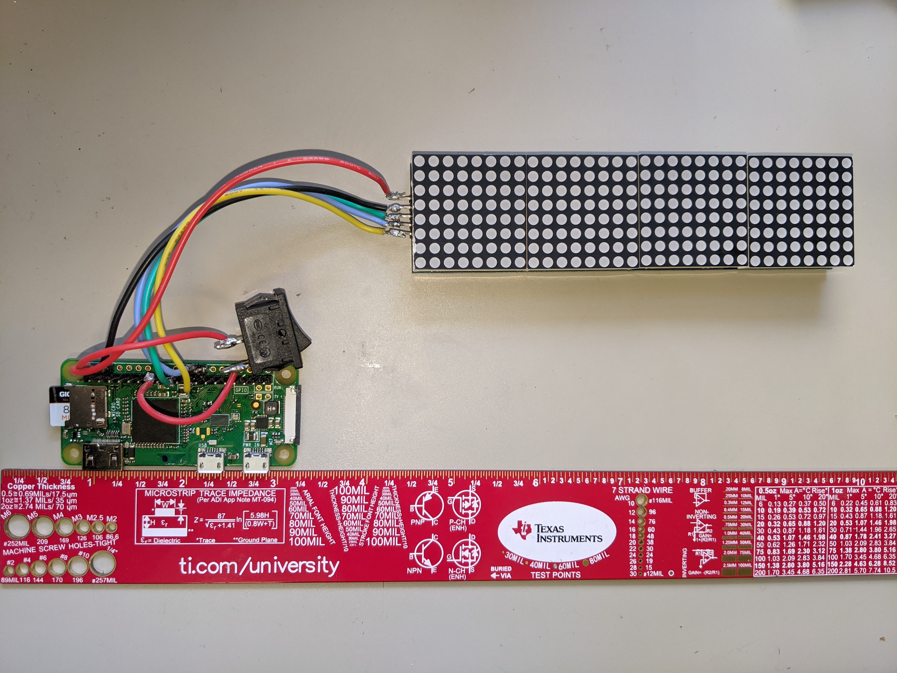

# TextScroller
An app that pulls from messages from firebase to a local device which displays said message. 

## Display 
The display used is a [MAX7219 Dot led Matrix](https://www.amazon.com/gp/product/B07T639GZF/ref=ppx_yo_dt_b_asin_image_o01_s00?ie=UTF8&psc=1)

## MCU
This project is using a Raspberry Pi Zero W. This was idea for it's internet capability, price, form factor, and ease of programming.
 
I booted the device headlessly (must be on 2.4 Wifi not 5g capable) and then used this repository to deploy the python code. This is when I discovered the Firebase-Admin library is not ARM compatable at the moment. So I used Pyrebase instead to my my database requests.

### Preliminary Photos
Here is the device outside of the box. the led matrix is 5in x 1.25in.

The mock up of the box is here. It will finally be done in wood.

### Final Product
